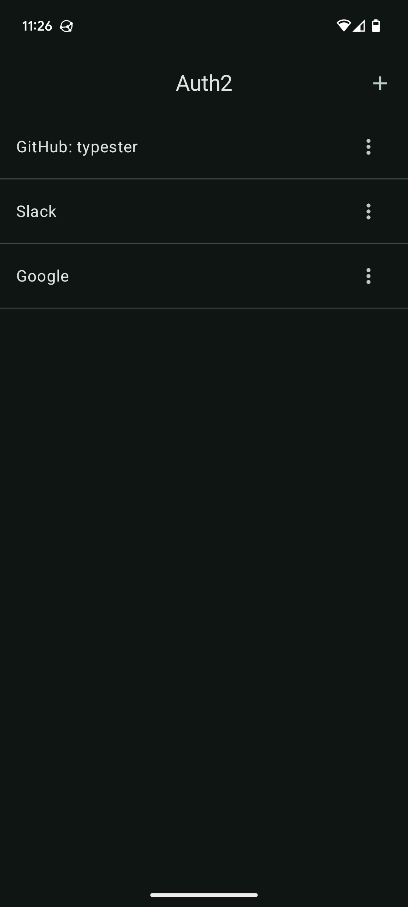
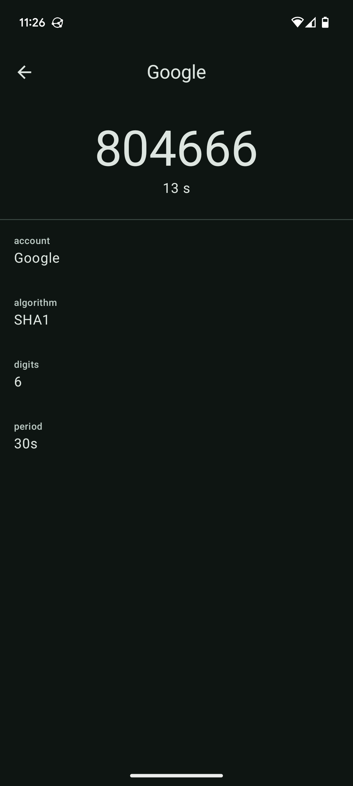
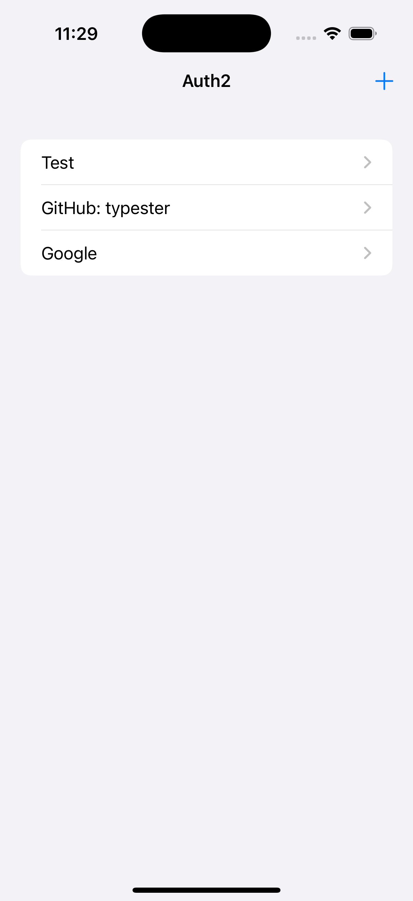
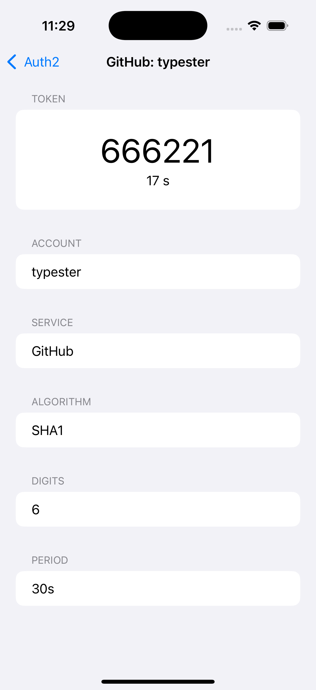

# Auth2 - Simple 2FA app

Super simple OTP (Time-based One-Time Password) app showcasing how to build a mobile app core in Rust.

<a href="screenshots/android_1.png">
  
</a>
<a href="screenshots/android_2.png">
  
</a>
<a href="screenshots/ios_1.png">
  
</a>
<a href="screenshots/ios_2.png">
  
</a>

## What is this?

This is a sample app demonstrating an architecture where the core of the mobile app is written in Rust, and the UI is implemented natively using Compose and SwiftUI.

For more details, please refer to the following blog entries:

- [Mobile-app core in Rust #1: Overview - typester.dev](https://typester.dev/blog/2024/11/14/mobile-app-development-with-rust)
- [Mobile-app core in Rust #2: Setup environment - typester.dev](https://typester.dev/blog/2024/11/16/mobile-app-core-in-rust-setup-environment)

## How to build, etc.

1. Setup environment by following "Setup environment" entry linked above.

### Android

```
cd ./core
./build-android-lib.sh
```

Once the build completes without errors, you should be able to open the =android= directory in Android Studio and run the app.

### iOS

```
cd ./core
cargo lipo --release
cargo build --release --target aarch64-apple-ios-sim
```

Once this completes without errors, you should be able to open =ios/Auth2.xcodeproj= in Xcode and run the app.

## Author

Daisuke Murase <typester@gmail.com>
